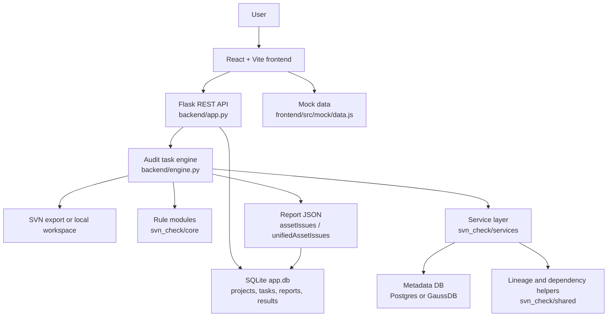

# Architecture

本文档基于当前仓库代码结构描述系统架构，不包含未实现能力的承诺。

## 总体架构图

## 核心模块说明

- `frontend/src/App.jsx`：前端路由、任务状态和结果页组合。
- `frontend/src/services/apiClient.js`：统一 API 请求封装。
- `frontend/src/config/api.js`：读取 `VITE_API_BASE_URL`，默认指向本地 Flask API。
- `frontend/src/mock/data.js`：后端不可用或无实时任务时的演示数据。
- `backend/app.py`：Flask API 入口，提供健康检查、项目列表、任务创建、任务查询、报告和结果查询。
- `backend/database.py`：SQLite 平台运行库初始化，创建 `projects`、`audit_tasks`、`task_reports`、`audit_results`、`fine_report_items`。
- `backend/engine.py`：审计任务编排层，负责加载 `svn_check` 真实规则模块、拉取 SVN 或读取本地目录、执行工作流、生成报告 JSON。
- `backend/svn_check/core`：规则实现，包括 SQL、DDL、Python、调度、报表等检查。
- `backend/svn_check/services`：SVN、工作区、元数据、AI、诊断、外部链接构造等服务边界。
- `backend/svn_check/shared`：数据库路由、血缘映射、依赖图等共享工具。

## 主要数据流

1. 用户在前端选择工作流并提交审计任务。
2. 前端调用 `POST /api/audit-tasks`。
3. 后端写入 `audit_tasks`，启动后台线程执行 `engine.start_task`。
4. 引擎根据 `sourceType` 拉取 SVN 或读取本地目录。
5. 引擎按工作流调用 `hcyt`、`nups` 或 `fine-report` 相关规则。
6. 规则读取变更文件，并按需访问元数据库、调度表、血缘辅助数据。
7. 引擎将审计明细写入 `audit_results`，将结构化报告写入 `task_reports`。
8. 前端轮询 `GET /api/audit-tasks/:id` 获取进度，完成后读取 `GET /api/audit-tasks/:id/report` 渲染结果。

## 审计结果流转

当前报告主要包含：

- `task`：任务状态、工作流、变更数量、错误数、警告数。
- `svn`：分支、变更、冲突等来源信息。
- `changes`：本次变更文件概览。
- `sqlChecks`、`pyScripts`、`reports` 等工作流特定结果。
- `assetIssues`：规则识别出的资产问题。
- `unifiedAssetIssues`：面向外部系统适配的统一风险结构。

`unifiedAssetIssues` 只是转换边界，不表示必须部署外部资产门户。外部系统对接应通过后续适配层完成。

## 元数据服务边界

元数据访问集中在：

- `backend/svn_check/services/audit_metadata_service.py`
- `backend/svn_check/services/db_service.py`
- `backend/svn_check/shared/db/router.py`
- `backend/svn_check/shared/db/postgres.py`
- `backend/svn_check/shared/db/gaussdb.py`

当前设计允许在元数据库不可用时降级：部分依赖、禁用状态、源系统标注、分区或登记检查会弱化为提示或空结果，静态规则仍可运行。

## 与数据资产门户/外部系统的关系

当前平台与外部资产门户不是强耦合关系：

- 平台可以独立运行、创建任务、展示审计结果。
- 资产问题通过 `assetIssues` 和 `unifiedAssetIssues` 表达，便于未来转换到资产门户、工单或消息系统。
- `portal_link_builder` 等模块提供链接构造边界，但部署平台本身不要求另一个门户同时存在。
- 若目标环境没有资产门户，应隐藏或忽略外部跳转链接，仅保留风险描述和整改建议。

## 定时同步任务与运行时关系

当前仓库没有内置定时同步目录。建议将元数据同步作为独立层处理：

- 同步任务写入 Postgres/GaussDB 元数据表。
- 平台运行时只读取最近可用快照。
- 同步失败不应阻塞前后端启动。
- 每次快照应记录数据日期，便于审计报告解释元数据新鲜度。

## 当前限制

- 平台运行库固定为 SQLite，尚未提供 PostgreSQL 运行库模式。
- 没有内置 Dockerfile、docker-compose 或 Helm chart。
- 没有统一 lint 配置。
- 元数据同步脚本未内置，需要按目标环境补充。
- 前端 mock/API 模式没有显式开关，主要通过 API 可用性和任务 ID 触发回退。
- 历史原型和 mock 数据仍需在公开发布前复核脱敏。

## 未来规划

- 增加容器化和生产配置样例。
- 提供统一元数据同步任务模板。
- 增加配置校验和启动前自检。
- 将统一风险输出适配到可插拔 connector。
- 补齐 CI、lint、端到端测试和安全扫描。
