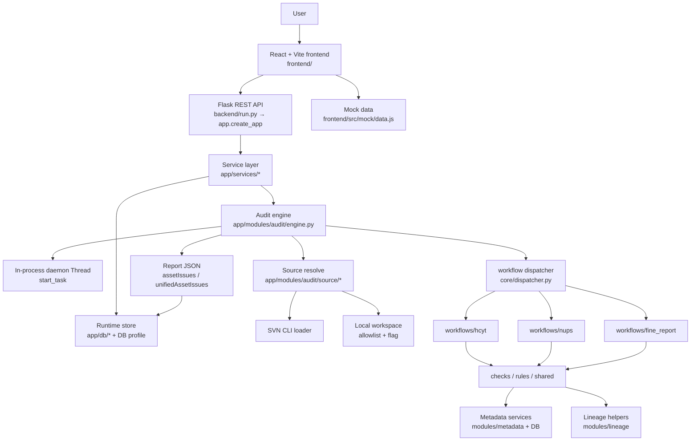

# Architecture

本文档基于**当前仓库代码结构**描述系统架构，不包含未实现能力的承诺。

> 历史路径说明：`backend/svn_check`、`backend/app.py`、`backend/engine.py` 已退役。  
> 当前入口为 `backend/run.py`，领域代码在 `backend/app/`。若其它文档仍写旧路径，以本文与根目录 [README.md](../README.md)、[backend/README.md](../backend/README.md) 为准。

## 总体架构图



## 分层与包职责

| 层 | 路径 | 职责 |
|----|------|------|
| 入口 | `backend/run.py` | 创建 Flask app；`__main__` 时按 settings 监听 |
| App Factory | `backend/app/__init__.py` | 加载 `.env`、日志、CORS、注册 Blueprint、请求 ID 和统一错误；默认不修改任务状态 |
| HTTP | `backend/app/routes/` | 参数读取、基础校验、HTTP 状态与 JSON；不写领域规则 |
| 业务编排 | `backend/app/services/` | 任务创建/查询、报告、结果、血缘、健康检查；不依赖 Flask `request` |
| 审计领域 | `backend/app/modules/audit/` | 任务引擎、工作流 runner、规则、来源、报告构建 |
| 血缘 | `backend/app/modules/lineage/` | 映射资源路径、缓存、遍历、登记表 |
| 元数据 | `backend/app/modules/metadata/` | 审计元数据访问、模型与公开数据视图 |
| 持久化 | `backend/app/db/` | profile 解析、连接、runtime store、逻辑表名、方言 SQL |
| 迁移 | `backend/app/migrations/` + `backend/migrations/` | runner 与三方言版本化 SQL |
| 配置 | `backend/app/settings.py`、`app/config/`、`backend/configs/` | 运行时安全、审计规则 YAML、数据库/SVN 部署配置 |
| 前端 | `frontend/src/` | 页面、hooks、API client、mock、展示 utils |

### 审计模块内部结构

推荐以以下路径为**规范入口**（canonical）：

```text
app/modules/audit/
├── engine.py              # TaskRun 编排；start_task 启线程
├── core/                  # dispatcher、executor、run state/registry、finalizer
├── source/                # resolver、svn、workspace、download
├── workflows/
│   ├── hcyt/              # runner、orchestrator、checks、report…
│   ├── nups/
│   └── fine_report/
├── shared/                # findings、dependency、lineage payload 等共享
├── rules/                 # AssetIssue、portal 链接等
├── integrations/          # AI、诊断
└── prompts/               # LLM 提示词模板
```

部分顶层文件（如 `hcyt_runner.py`、`source_resolver.py`、`workflow_dispatcher.py`）是 **兼容 re-export / 别名**，便于迁移期 import 不中断。新代码应优先引用 `workflows/*`、`core/*`、`source/*`。

## 主要数据流

1. 用户在前端选择工作流并提交审计任务（或 mock 模式直接渲染演示数据）。
2. API 模式下前端调用 `POST /api/audit-tasks`（或等价 `POST /api/audit-runs`）。
3. `audit_task_service.create_task`：
   - 规范化 `sourceType`（`local` / `svn`；`git` 拒绝；可从路径推断）；
   - 本地源校验 `AUDIT_LOCAL_SOURCE_ENABLED` 与根目录 allowlist；
   - 写入运行库任务行；支持 `Idempotency-Key` 去重；
   - 调用 `engine.start_task` 启动后台线程。
4. `TaskRun.run()` 解析来源（SVN export 或本地工作区），构造 `WorkflowRuntimeContext`。
5. `core.dispatcher.run_workflow` 按 `hcyt` / `nups` / `fine-report` 分发到对应 runner。
6. Runner 执行规则检查，按需访问元数据库、调度表、血缘辅助数据；进度写入进程内 registry 与 DB 任务行。
7. 完成后写入报告 JSON 与明细结果；前端通过 `GET .../status`、`.../partial-result`、`.../report` 轮询与展示。

## 审计结果流转

报告主要包含（字段随工作流略有差异）：

- `task`：状态、工作流、变更数量、错误/警告计数等。
- 来源信息：分支、工作区、变更列表（历史字段名可能含 `svn`）。
- `changes`：本次变更文件概览。
- 工作流特定块：如 `sqlChecks`、`pyScripts`、`schedule`、`reports`、`dws` / `hive` 等。
- `assetIssues`：规则识别出的资产问题。
- `unifiedAssetIssues`：面向外部系统适配的统一风险结构。

`unifiedAssetIssues` 是转换边界，不表示必须部署外部资产门户。外部对接应通过后续适配层完成。

## 来源类型（Source）契约

| 类型 | 支持情况 | 说明 |
|------|----------|------|
| `svn` | 支持 | 经 SVN CLI 拉取；凭据来自 `configs/svn.yaml`（勿提交真实文件） |
| `local` | 可选 | 默认关闭；需 `AUDIT_LOCAL_SOURCE_ENABLED=true` 且路径落在 `AUDIT_LOCAL_SOURCE_ROOTS` 下 |
| `git` | **不支持** | 前后端均返回明确错误，避免误走 SVN 路径 |
| `selfcheck` | 内部/自检 | 开发与回归场景使用 |

前端 `VITE_ENABLE_LOCAL_SOURCE` **只影响 UI**，不是安全边界。

## 元数据服务边界

元数据访问集中在：

- `backend/app/modules/metadata/services/audit_metadata_service.py`
- `backend/app/modules/metadata/services/db_service.py`
- `backend/app/db/metadata/compat/`（Postgres / GaussDB 路由与实现）
- 运行 profile：`backend/app/db/profiles.py` + `backend/configs/database.yaml`

设计要点：

- 平台只选择 **postgresql** 或 **dws** 一类生产 profile（见配置文档）。
- 运行表与元数据查询默认同 profile；可配置只读元数据 profile 做镜像查询。
- 元数据库不可用时允许降级：部分依赖、禁用状态、分区或登记检查弱化为提示或空结果，静态规则仍可运行。
- 资产门户词根（term roots）可通过 `ASSET_PORTAL_BASE_URL` 拉取，失败时用进程内/文件缓存，不阻塞核心审计启动。

## 与数据资产门户/外部系统的关系

- 平台可独立运行、创建任务、展示审计结果。
- 资产问题通过 `assetIssues` / `unifiedAssetIssues` 表达，便于转换到门户、工单或消息系统。
- `portal_link_builder` 等提供链接构造边界；无门户时隐藏跳转即可。

## 定时同步与运行时关系

仓库**没有**内置元数据定时同步目录。建议：

- 同步任务独立部署，写入元数据表或镜像库。
- 平台运行时只读最近可用快照。
- 同步失败不应阻塞前后端启动。
- 快照应记录数据日期，便于报告解释元数据新鲜度。

血缘映射资源默认约定见开发文档：Excel / 缓存路径可配置，缺失时返回 `unavailable`，不得当成“空成功”。

## 部署约束

### 单实例执行模型（当前强制假设）

- 任务通过 `threading.Thread(..., daemon=True)` 在**本进程**执行。
- 进度 registry 在进程内存中；DB 保存任务行与报告。
- `create_app()` 是无任务状态副作用的应用工厂。确认旧进程已经停止后，可执行一次
  `python backend/scripts/recover_orphan_tasks.py`，将库中遗留的 `running/queued`
  任务失败收口。无论直接运行还是由 WSGI 导入，创建应用都不会隐式恢复任务。

因此：

1. **必须使用单进程、单 worker**（例如 `gunicorn -w 1`、单实例 waitress）。
2. 多 worker 或多实例不受支持；当前没有持久化 owner/lease/heartbeat，不能保证任务只执行一次。
3. 进程崩溃会丢失未落库的内存进度；daemon 线程随进程退出而终止。

中长期演进方向：任务租约（`owner_id` / `lease_until` / heartbeat）、条件更新领取与 CAS 完成，或外部队列；在此之前不要假设水平扩展。

### HTTP 与安全默认值

- 默认 `AUDIT_HOST=127.0.0.1`，`AUDIT_PORT=5088`，`AUDIT_DEBUG=false`。
- CORS 默认仅本地 Vite Origin；禁止配置 `*`。
- 本地目录审计默认关闭。
- `app.auth.require_permission` 为扩展点，**当前未强制鉴权**——仅适合可信内网。

## 前端架构要点

- `App.jsx`：页面组合、任务状态与结果路由（按工作流切换结果页）。
- `config/api.js`：`VITE_AUDIT_DATA_MODE`、`VITE_API_BASE_URL`。
- `hooks/useAuditRun`：轮询 status / partial-result，合并为页面模型。
- `services/reviewService` + `apiClient`：统一请求。
- `mock/data.js`：mock 模式演示数据；API 失败不静默回落 mock。
- 结果展示大量逻辑在 `utils/*Presentation.js`，便于页面变薄。

## 主要 HTTP API

| 方法 | 路径 | 说明 |
|------|------|------|
| GET | `/api/health` | 健康检查 |
| GET | `/api/projects` | 项目列表 |
| GET | `/api/audit-tasks` | 任务列表 |
| POST | `/api/audit-tasks` | 创建任务（`Idempotency-Key` 可选） |
| GET | `/api/audit-tasks/:id` | 任务详情 |
| GET | `/api/audit-tasks/:id/report` | 完整报告 |
| GET | `/api/audit-tasks/:id/source-file` | 源文件下载 |
| GET | `/api/audit-tasks/:id/lineage/subgraph` | 血缘子图 |
| POST | `/api/audit-runs` | 与创建任务等价入口 |
| GET | `/api/audit-runs/:id/status` | 运行状态（no-store） |
| GET | `/api/audit-runs/:id/partial-result` | 部分结果（no-store） |
| GET | `/api/audit-results` | 明细结果 |
| GET | `/api/fine-report/items` | FineReport 项 |
| GET | `/api/audit-configuration/*` | 工作流等只读配置（无密钥） |

请求链路带 `X-Request-ID`（客户端可传，否则服务端生成）。

## 当前限制

- 任务执行与 orphan 恢复语义绑定**单实例**，不适合多 worker / 多副本。
- 认证授权未落地，权限装饰器默认可放行。
- 无内置 Dockerfile / docker-compose / Helm。
- Git 来源未实现。
- audit 模块存在迁移期双轨路径（扁平兼容文件 + `workflows`/`core`/`source`）。
- 部分 logger 名称仍可能带历史前缀（如 `svn_check.*`），不影响功能。
- 历史原型、mock 与部分 docs 迁移记录需在公开发布前复核脱敏与归档。

## 未来规划

- 任务租约/心跳或可靠队列，明确重启与接管语义。
- 身份认证与 `require_permission` 生效。
- 容器化与生产配置样例。
- 统一元数据同步任务模板与快照新鲜度。
- 可插拔风险输出 connector。
- 收敛兼容 re-export，仅保留规范目录。
- CI、E2E 与安全扫描。

## 相关文档

- [根 README](../README.md) — 快速开始与目录总览
- [backend/README.md](../backend/README.md) — 后端包约定与脚本
- [deployment.md](deployment.md) — 部署
- [development.md](development.md) — 本地开发
- [configuration.md](configuration.md) — DB profile
- [db_migration.md](db_migration.md) — 迁移
- [project_architecture_audit.md](project_architecture_audit.md) — 历史工程体检（部分问题可能已部分修复，以代码为准）
