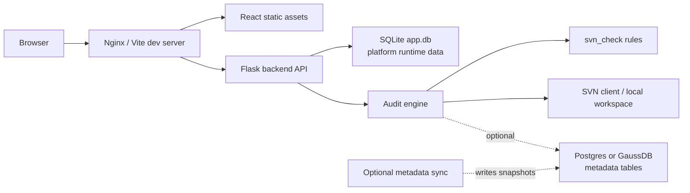

# Deployment Guide

本文档说明 SQL Review Platform 的本地、单机和内网部署方式。当前版本未内置 Dockerfile 或 docker-compose。

## 部署拓扑



## 环境要求

- Python：3.10+，建议 3.11。
- Node.js：18+，npm 9+。
- 数据库：平台运行数据默认使用 SQLite；规则元数据可使用 Postgres 12+，也可按实际环境适配 GaussDB/JDBC。
- 操作系统：本地开发支持 Windows、Linux、macOS；生产建议 Linux 单机或内网服务器。
- 可选工具：SVN 命令行客户端、Nginx。

## 后端部署步骤

创建虚拟环境：

```bash
cd backend
python -m venv .venv
source .venv/bin/activate
```

Windows 使用：

```powershell
cd backend
python -m venv .venv
.\.venv\Scripts\activate
```

安装依赖：

```bash
pip install -r requirements.txt
```

准备配置：

```bash
cp backend/svn_check/configs/database.example.yaml backend/svn_check/configs/database.yaml
cp backend/svn_check/configs/svn.example.yaml backend/svn_check/configs/svn.yaml
```

也可以使用环境变量覆盖数据库配置：`SVN_CHECK_DB_BACKEND`、`SVN_CHECK_PG_HOST`、`SVN_CHECK_PG_PORT`、`SVN_CHECK_PG_DB`、`SVN_CHECK_PG_USER`、`SVN_CHECK_PG_PASSWORD`、`SVN_CHECK_PG_SCHEMA`。

初始化规则元数据库：

```bash
cd backend
python init_pg.py
```

平台运行库 SQLite 由 `backend/database.py` 在 Flask 启动时自动创建，默认路径为 `backend/data/app.db`。

开发启动：

```bash
cd backend
python app.py
```

生产建议使用项目依赖中已有的 WSGI 服务：

```bash
cd backend
gunicorn -w 4 -b 0.0.0.0:5000 app:app
```

Windows 或简单单机部署可使用：

```bash
cd backend
waitress-serve --host 0.0.0.0 --port 5000 app:app
```

当前项目是 Flask WSGI 应用，不使用 uvicorn。

systemd 示例：

```ini
[Unit]
Description=SQL Review Platform Backend
After=network.target

[Service]
WorkingDirectory=/opt/sql-review-platform/backend
Environment="SVN_CHECK_DB_BACKEND=postgres"
ExecStart=/opt/sql-review-platform/backend/.venv/bin/gunicorn -w 4 -b 127.0.0.1:5000 app:app
Restart=always
RestartSec=5

[Install]
WantedBy=multi-user.target
```

请按实际安装路径调整 `WorkingDirectory` 和 Python 虚拟环境路径。

## 前端部署步骤

安装依赖：

```bash
cd frontend
npm install
```

配置 API 地址：

```bash
cp .env.example .env
```

本地开发示例：

```text
VITE_API_BASE_URL=http://127.0.0.1:5000/api
```

单机 Nginx 同域代理可设置：

```text
VITE_API_BASE_URL=/api
```

本地启动：

```bash
npm run dev
```

构建：

```bash
npm run build
```

构建产物位于 `frontend/dist`。

Nginx 静态部署示例：

```nginx
server {
    listen 80;
    server_name example.com;

    root /opt/sql-review-platform/frontend/dist;
    index index.html;

    location / {
        try_files $uri $uri/ /index.html;
    }

    location /api/ {
        proxy_pass http://127.0.0.1:5000/api/;
        proxy_set_header Host $host;
        proxy_set_header X-Real-IP $remote_addr;
        proxy_set_header X-Forwarded-For $proxy_add_x_forwarded_for;
        proxy_set_header X-Forwarded-Proto $scheme;
    }
}
```

## 数据库初始化

- 平台运行库：SQLite，自动初始化，无需手动 DDL。
- 规则元数据库：Postgres DDL 位于 `backend/svn_check/migrate/postgres_schema.sql`，使用 `backend/init_pg.py` 执行。
- 当前仓库没有统一的元数据装载脚本；如需真实元数据，请按目标环境准备导入流程或后续补齐同步任务。

## 元数据同步/定时任务部署

当前仓库没有独立 `jobs/`、`crontab` 或调度脚本目录。元数据同步应作为可选、独立的数据准备层部署：

- 定时从调度系统、元数据系统或资产系统抽取快照。
- 写入 Postgres/GaussDB 兼容的 `dwp.p_*` 表。
- 每次同步记录数据日期、快照日期、来源系统、行数和失败原因。
- 同步失败时保留上一可用快照，并在平台日志或同步日志中明确标记快照日期。

前后端启动不强依赖元数据同步；缺失元数据时部分规则会降级或提示人工复核。

## 配置文件说明

详见 [configuration.md](configuration.md)。核心文件：

- `frontend/.env.example`
- `backend/svn_check/configs/database.example.yaml`
- `backend/svn_check/configs/svn.example.yaml`
- `backend/svn_check/configs/database.yaml`，部署环境私有文件，不应提交。
- `backend/svn_check/configs/svn.yaml`，部署环境私有文件，不应提交真实值。

## 启停与健康检查

健康检查：

```bash
curl http://127.0.0.1:5000/api/health
```

预期返回：

```json
{"service":"code-review-platform-backend","status":"ok"}
```

systemd 启停：

```bash
systemctl start sql-review-platform
systemctl stop sql-review-platform
systemctl status sql-review-platform
```

前端静态站点更新后重载 Nginx：

```bash
nginx -t
systemctl reload nginx
```

## 日志位置

- 开发模式：后端日志输出到当前终端。
- gunicorn/systemd：查看 `journalctl -u sql-review-platform -f`。
- waitress：取决于进程管理器或控制台重定向。
- Nginx：通常位于 `/var/log/nginx/access.log` 和 `/var/log/nginx/error.log`。
- 审计任务日志：写入 SQLite `audit_tasks.logs_json`，前端任务详情轮询展示。
- 元数据同步日志：当前未内置，建议同步任务自行输出独立日志并记录快照日期。

## 常见问题排查

- 后端启动失败：检查 Python 版本、虚拟环境、`pip install -r requirements.txt` 是否成功。
- 前端请求失败：检查 `VITE_API_BASE_URL`、Nginx `/api/` 代理和后端健康检查。
- SVN 任务失败：确认 `svn` 命令在 PATH 中，且 `svn.yaml` 使用的是部署环境真实可访问地址。
- 数据库连接失败：先用数据库客户端验证 host、port、库名、用户、schema，再检查 `SVN_CHECK_*` 环境变量覆盖。
- 元数据为空：确认 `init_pg.py` 只建表不导入业务数据；需要另行准备元数据快照。
- CORS 问题：开发模式后端已对 `/api/*` 启用 CORS；生产建议使用同域 Nginx 代理减少跨域配置。
