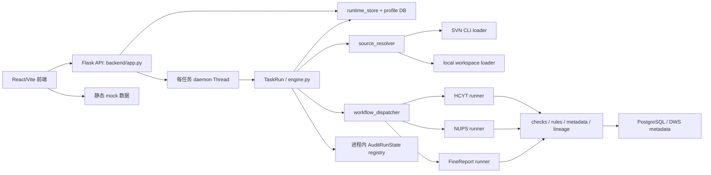
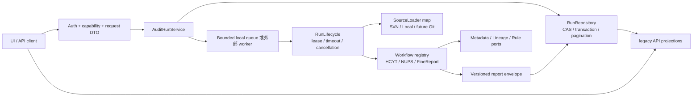

# 当前仓库工程体检与架构审计

> 审计日期：2026-07-11
> 审计范围：当前 `main` 分支工作树中的后端、前端、测试、文档、数据库脚本、启动脚本、配置与近期 Git 历史。
> 审计方式：静态代码审阅、引用检索、Git 历史/状态核验、现有后端与前端测试、Python 编译检查、Vite 生产构建。
> 边界：本轮只新增本报告；未修改业务代码、测试断言、配置或部署文件，未执行重构，未 push。
> 严重度：P0=可能导致安全事故、任务状态错误或生产不可用；P1=明显阻碍稳定性、迁移或扩展；P2=中期维护债；P3=工程体验问题。

## 1. 执行摘要

当前仓库已经完成一次有价值的拆分：三类工作流已有独立 runner，规则、报告构建、运行时存储、数据库 profile 和兼容层均能从目录上识别；225 个后端测试和 49 个前端测试通过，前端可生产构建。这说明项目不是“不可维护的单体脚本”，也不适合推倒重写。

但系统仍处于“单进程可信内网工具”向“可部署审计平台”过渡的中间态。最关键的问题不是文件数量，而是运行语义尚未收口：API 无认证却可触发本机目录读取；进程导入时会把所有运行中任务置为失败；真实执行仍用每任务 daemon 线程和内存 registry，而已实现的依赖感知 executor 仅被测试使用；前端宣称支持 Git，后端却把所有非本地来源送入 SVN；血缘默认路径仍指向已经删除的 `backend/svn_check`，并含已损坏的中文表头别名。

综合健康度：**55/100**。当前适合受控的单机、可信内网和人工看护运行；不适合直接多 worker、多实例或外网部署。

| 维度 | 得分 | 核心判断 |
|---|---:|---|
| 架构设计 | 61/100 | runner 拆分真实有效，但 `TaskRun`/runtime context 仍是高耦合服务定位器 |
| 可维护性 | 55/100 | 模块命名逐步清晰；契约、状态、兼容形态和历史文档仍多源维护 |
| 测试体系 | 68/100 | 数量与局部契约覆盖较好；真实 DB、真实 Flask、并发恢复和浏览器 E2E 空缺 |
| 数据库设计 | 54/100 | profile、事务封装和多方言 schema 已建立；索引、约束、原子完成语义不足 |
| 异步任务设计 | 38/100 | 有任务模型和 executor 原型，但生产路径仍是进程内 daemon 线程 |
| 前端工程 | 62/100 | API client/hook/页面已分层；大组件、mock 生产耦合、契约重复明显 |
| 安全与部署 | 32/100 | 仅适合可信内网；认证、授权、输入边界、凭据日志与生产启动默认值未收口 |

问题统计：**P0 2 项、P1 13 项、P2 9 项、P3 5 项，共 29 项**。未发现已经发生的数据损坏证据；P0 是由当前代码可直接推导出的安全或状态错误路径。

最优先处理的五项：

1. 给任务创建、任务读取和本地目录来源建立认证/授权与服务端 allowlist。
2. 明确单实例执行模型，移除 import-time 全量失败写入，或引入带租约/心跳的持久化执行所有权。
3. 纠正 Git 契约：实现独立 Git loader，或在前后端同时禁用 Git。
4. 修复血缘资源路径与乱码常量，并增加默认路径冒烟测试。
5. 让任务终态、报告和明细在同一事务/幂等完成协议中收口。

## 2. 当前系统架构概览

主请求链路：

1. `POST /api/audit-tasks` 在 `backend/app.py:139-220` 解析多个历史字段并先插入任务。
2. `backend/audit/engine.py:598-602` 为每个任务启动 daemon 线程。
3. `TaskRun.run()` 加载动态模块、解析来源并通过 dispatcher 选择工作流。
4. runner 通过包含 37 个字段/回调的 `WorkflowRuntimeContext` 获取规则、状态、持久化和报告能力。
5. 运行进度同时写入进程内 `AuditRunState` 与数据库任务行；完成时写任务终态、报告 JSON 和兼容明细。
6. 前端 `useAuditRun` 每 1.5 秒顺序请求 status 与 partial-result，再把多套字段合并成页面模型。

数据库边界：`backend/db/profiles.py` 生产配置只接受 PostgreSQL/DWS；`connection.py`、`schema.py` 和测试仍保留 SQLite 分支。runtime 表与 metadata 表逻辑上分开，但 profile 被要求共用。血缘映射另外直接使用 SQLite 文件，形成第三种持久化语义。

## 3. 当前架构优点

- HCYT、NUPS、FineReport runner 已独立，差异逻辑没有被错误抽象成一个巨型条件函数。
- `workflow_dispatcher.py` 很小，新工作流的入口位置明确；短期无需引入框架式插件系统。
- `db/profiles.py`、`tables.py`、`sql_runner.py` 已形成数据库方言与逻辑表名边界，多数业务 SQL 使用参数绑定。
- runtime schema 为 PostgreSQL/DWS/SQLite 保持同构，迁移脚本和 profile 验证均有单测。
- `compat.py`、`mapping_compat.py` 等兼容边界有显式命名，没有把全部历史行为伪装成新领域模型。
- `AssetIssue` 等局部结构已类型化，说明可以按高价值边界渐进收口，而非一次性改写全部 dict。
- 前端 API client、service、hook、页面已分层；API 模式失败不会静默回落 mock，避免展示假成功。
- 现有测试覆盖规则、runner、报告构建、profile、迁移与多项兼容契约，适合作为渐进治理保护网。

## 4. P0 问题

### P0-01 无认证 API 可触发任意本机目录审计

- **类型**：安全 / 权限边界。
- **位置**：`backend/app.py:23-27,139-220,248`；`backend/audit/checks/workspace_service.py:58-86`；`frontend/src/config/auditSources.js:69-75`。
- **当前实现**：Flask 对 `/api/*` 开放任意 CORS origin，无认证、授权、CSRF/来源校验或请求配额；后端只检查路径存在且为目录，随后递归读取。前端的 `VITE_ENABLE_LOCAL_SOURCE` 只是 UI 开关，直接调用 API 可绕过。开发入口绑定 `0.0.0.0` 且 `debug=True`。
- **为何是问题**：能访问服务的调用者可指定服务账号可读的任意目录、创建大量后台线程，并从状态、日志和报告中观察内部路径/规则结果。前端开关不是安全边界。
- **实际影响**：本机文件元数据/部分内容派生信息泄露、CPU/内存/数据库资源耗尽、内部 SVN 被服务端代访问；若 debug server 被误用于共享环境，风险进一步放大。
- **性质**：当前真实漏洞；是否可利用取决于网络可达性和服务账号权限，不是已经发生事故的结论。
- **建议**：先加服务端部署模式开关，默认拒绝 `local`；本地模式只允许配置的根目录并对 `resolve()` 后路径做 `is_relative_to` 校验；任务 API 增加身份认证、工作流/来源授权、并发配额和审计日志；生产入口禁止 debug，CORS 改为明确 origin。
- **暂缓理由**：认证方案可按现有内网身份设施选型，但在选型前也应先实施“默认禁用 local + allowlist + 非 debug”止血。
- **预计范围**：API 中间件、配置、workspace loader、部署文档、前端能力探测，约 6-10 个文件。
- **业务语义影响**：会收紧谁可以审计什么来源；规则判断语义不变。
- **补充测试**：未认证 401/403；越界路径、符号链接/目录 junction、UNC 路径、大小/文件数上限；CORS；生产配置启动；并发配额。

### P0-02 多 worker/多实例会错误终止彼此的运行中任务

- **类型**：异步任务 / 状态一致性 / 部署。
- **位置**：`backend/app.py:27`；`backend/db/runtime_store.py:17-25`；`backend/audit/engine.py:598-602`；`backend/audit/run_registry.py:14-29`；`README.md:143-145`。
- **当前实现**：每个进程导入 `app.py` 时无条件执行 `fail_orphan_tasks()`，把数据库中所有 `running/queued` 任务改为失败；真正执行者是各进程私有 daemon 线程，状态 registry 也只在内存。README 同时建议 gunicorn/waitress 常驻运行。
- **为何是问题**：gunicorn 多 worker 启动时，后启动的 worker 会把先启动 worker 的活跃任务置为失败；滚动发布或第二实例启动也会产生同样结果。数据库状态与仍在运行的线程随后相互覆盖。
- **实际影响**：任务展示失败但仍执行、终态被后写覆盖、重复执行、报告与任务状态不一致；服务重启时 daemon 线程直接丢失。
- **性质**：单进程时是潜伏风险；按文档采用多 worker/多实例即为确定性错误路径。
- **建议**：短期明确并强制单 worker，并把 orphan 修复移到显式启动协调步骤；中期为任务增加 `owner_id/lease_until/heartbeat/version`，用条件更新领取与完成；只有过期租约可恢复或失败。不要仅换成全局锁。
- **暂缓理由**：若近期只允许单机单进程，可暂缓外部队列，但必须同步部署约束并防止误开多 worker。
- **预计范围**：任务表 migration、runtime repository、启动入口、执行器、部署配置，约 8-14 个文件。
- **业务语义影响**：不改变规则结果；会明确重启、接管和重复提交语义。
- **补充测试**：两个进程/owner 竞争领取；第二实例启动不修改有效租约；过期接管；重复完成 CAS；重启恢复；滚动发布回放。

## 5. P1 问题

### P1-01 前端承诺 Git，后端实际始终调用 SVN

- **类型**：前后端契约 / 来源适配。
- **位置**：`frontend/src/config/auditSources.js:34-65`、`HomePage.jsx:119-137`；`backend/app.py:46-62,157-168`；`backend/audit/source_resolver.py:24-57`；`engine.py:417-434`。
- **当前实现**：前后端都能识别 `git`，前端允许提交；但 resolver 只区分 local/非 local，非 local 全部调用 `svn_main`，并把返回来源强制改成 `svn`。
- **为何/影响**：合法 Git URL 会进入 SVN CLI 后失败，或状态/报告被错误标记为 SVN；这是公开 UI 与执行能力不一致。
- **性质**：当前真实功能缺陷。
- **建议**：若近期无 Git loader，前后端共同拒绝 Git 并返回明确 capability；否则增加 `SourceLoader` 映射，仅按来源选择 loader，保持统一 `WorkspaceInfo` 输出。
- **暂缓理由**：可暂缓 Git 实现，不应暂缓契约纠正。
- **范围/语义**：4-8 个文件；影响来源能力，不改变三个工作流规则。
- **测试**：真实临时 Git repo、HTTP/SSH URL 路由、unsupported capability、报告 sourceType 一致性。

### P1-02 血缘默认路径仍指向已删除目录，中文表头别名已损坏

- **类型**：历史兼容 / 数据加载。
- **位置**：`backend/lineage/mapping_compat.py:33-46`；`backend/lineage/traversal.py:11-18`；近期 `svn_check` 退役提交链。
- **当前实现**：默认 Excel/SQLite 路径仍拼到 `backend/svn_check/...`，该目录已删除；`HEADER_ALIASES` 中中文文字为乱码字面量。测试多传入临时路径，没有验证默认资源。
- **为何/影响**：默认血缘缓存状态、Excel 导入或遍历会找不到文件；即使提供 Excel，正常中文表头也无法匹配。
- **性质**：当前真实缺陷；是否命中取决于部署是否调用这条默认路径。
- **建议**：将资源位置变成经校验的配置项，提供迁移后的默认目录；恢复 UTF-8 别名并加 fixture 冒烟测试；对缺失资源返回可诊断的 capability 状态。
- **暂缓理由**：若当前只消费在线宽表摘要而不使用 mapping cache，可暂缓缓存重建，但必须先避免“存在却不可用”的默认值。
- **范围/语义**：lineage 2-5 个文件、配置与测试；不改变遍历算法。
- **测试**：真实中文表头 xlsx、默认路径、缺失/过期缓存、只读目录、Windows/ Linux 路径。

### P1-03 SVN 凭据会随完整命令写入日志

- **类型**：安全 / 敏感信息。
- **位置**：`backend/audit/checks/svn_service.py:78-128`；`backend/configs/svn.yaml`。
- **当前实现**：密码通过 `--password` 放入命令数组，随后整个 `command` 被传给 start/end/exception/slow 日志；默认还启用 `--trust-server-cert`。仓库仅跟踪脱敏的 `svn.example.yaml`，部署用 `svn.yaml` 必须保持本地忽略。
- **为何/影响**：部署填入密码后，日志、异常采集或控制台可持久化明文凭据；仓库地址也扩大内部信息暴露面。
- **性质**：当前代码路径真实，凭据是否已泄露需检查部署日志，本审计未读取生产日志。
- **建议**：构建专用脱敏命令视图；密码优先使用安全 credential store/环境注入，严禁记录参数值；证书信任改为显式配置且默认 false；跟踪文件只保留 example。
- **暂缓理由**：无。
- **范围/语义**：2-4 个文件；SVN 功能不变。
- **测试**：成功/失败/超时日志均不含 secret；含特殊字符凭据；证书默认策略。

### P1-04 生产异步路径未使用现有依赖感知 executor

- **类型**：架构 / 并发。
- **位置**：`backend/audit/executor.py`；`backend/audit/engine.py:258-461,598-602`；`backend/audit/run.py`。
- **当前实现**：`BoundedAuditExecutor` 有独立测试，但生产代码没有引用；真实 runner 通过回调手工改状态，HCYT 子步骤仍在 runner/orchestrator 中串并混合。`AuditRunState` 的 dict/list 读写没有快照锁。
- **为何/影响**：设计文档中的依赖图、限界并发、失败传播并不代表生产语义；未来一旦启用并行，API 读取可能得到撕裂快照，且全局模块/第三方库是否线程安全未定义。
- **性质**：当前架构分叉；并发竞态主要是扩展风险，executor 未接入是当前事实。
- **建议**：先选定唯一执行路径。若保留 executor，用一个工作流做垂直接入并让状态变更通过单一同步接口；若近期不接入，停止对外宣称已并行并删除/冻结实验路径。
- **暂缓理由**：规则执行并行可暂缓，状态模型收口不可长期双轨。
- **范围/语义**：8-15 个文件；可能改变执行顺序，规则结果应保持不变。
- **测试**：真实 runner 接入、依赖失败、并发上限、快照一致性、线程不安全依赖串行化。

### P1-05 缺少取消、超时、重试、幂等和背压统一语义

- **类型**：异步任务 / 可靠性。
- **位置**：`engine.py:400-461,598-602`；`run.py:16-28`；`useAuditRun.js:4-7,118-137`。
- **当前实现**：任务状态只有 queued/running/success/skipped/failed 与报告 pass/warn/fail；没有 cancel/timeout/retry attempt/idempotency key。每个请求无界创建线程，前端轮询错误会永久重试。
- **为何/影响**：慢 SVN/Excel/DB 可长期占用线程；重复点击生成重复任务；无法区分业务未通过、基础设施失败、取消和超时；故障时形成轮询风暴。
- **性质**：当前能力缺失；压力影响随使用量增加。
- **建议**：先定义状态机和幂等键；加全局并发队列/信号量与任务级 deadline；前端指数退避和最大连续错误提示。不要立即引入重量队列，除非多实例已成为近期目标。
- **暂缓理由**：分布式队列可暂缓；幂等、上限和超时不可缺失。
- **范围/语义**：API、表结构、executor、hook，约 8-12 个文件；会新增明确终态。
- **测试**：重复提交、超时、取消竞争、重试 attempt、队列满、前端退避。

### P1-06 任务终态、报告与明细不是一个原子完成单元

- **类型**：数据库 / 状态一致性。
- **位置**：`backend/db/runtime_store.py:102-179`；`engine.py:331-354`。
- **当前实现**：`persist_task_run_completion` 先用一个连接提交任务终态，再用另一个连接删除/插入报告；兼容 `audit_results` 又在工作流中独立 delete+逐行 insert。
- **为何/影响**：中途失败可形成“终态已完成但报告缺失/旧明细仍在”、或报告已更新但兼容明细不同步；逐行插入也扩大故障窗口。
- **性质**：当前真实一致性风险，未发现现存坏数据证据。
- **建议**：为完成动作提供 repository transaction，事务内 CAS 更新任务、upsert report、批量替换 issues；报告写入加 schema/version 与 checksum。若 DWS 外键/事务语义受限，至少用 completion version 做可重放幂等协议。
- **暂缓理由**：无；可先只收口完成路径。
- **范围/语义**：runtime_store/sql_runner/schema/engine/tests，约 5-8 个文件；业务结果不变。
- **测试**：每个写入点注入异常、重放完成、旧 version 拒绝、报告/明细一致性。

### P1-07 runtime schema 缺少关键索引和状态约束

- **类型**：数据库设计 / 性能 / 数据质量。
- **位置**：`backend/db/sql/{postgresql,dws,sqlite}/schema.sql`；`runtime_store.py:35-42,168-204`。
- **当前实现**：仅主键和外键，无 `audit_results(task_id)`、任务状态/时间索引、唯一业务键、CHECK 约束或级联策略；列表接口不分页，`list_audit_results(None)` 可全表读取。
- **为何/影响**：数据增长后任务历史、按 task 查 issue、启动 orphan 更新会扫描；拼写错误状态可入库；删除/归档边界不明确。
- **性质**：当前结构问题，性能影响是数据量相关风险。
- **建议**：基于查询计划加最小索引；状态值在应用枚举和 DB 约束统一；API 强制分页/上限；制定保留归档策略。DWS 不支持的约束需在 repository 验证替代。
- **暂缓理由**：不要无测量地创建大量索引；先覆盖 `task_id` 和历史排序两个热点。
- **范围/语义**：3 套 schema、migration、repository、API；查询结果语义不变。
- **测试**：迁移回放、重复/非法状态、分页、explain 基线、DWS 兼容。

### P1-08 元数据查询仍存在字符串拼接标识符

- **类型**：安全 / 数据库访问。
- **位置**：`backend/metadata/services/public_data.py:134-140`；调用点 `backend/audit/checks/nups_rule.py:196-200,277-280`。
- **当前实现**：从被审计文件路径推导 schema/table，再用 f-string 拼入 SQL 字面量。多数 runtime SQL 已参数化，但该 legacy metadata 查询未收口。
- **为何/影响**：恶意或异常文件/目录名可破坏查询，极端情况下形成注入；至少会导致检查异常或错误降级。
- **性质**：当前真实输入边界缺陷；可利用性取决于仓库命名权限和 DB 驱动。
- **建议**：值查询使用参数绑定；若必须插入标识符，使用严格 identifier parser/allowlist 和驱动 Identifier API。元数据函数不应接受任意 SQL。
- **暂缓理由**：无。
- **范围/语义**：2-4 个文件；规则含义不变。
- **测试**：引号、注释符、Unicode、超长名、非法 schema/table、正常大小写。

### P1-09 核心报告/API 契约多套并存且没有版本化 schema

- **类型**：数据模型 / 前后端契约。
- **位置**：`app.py:72-87,139-220`；`compat.py:37-56`；`run.py:233-250`；`useAuditRun.js:13-70`；`App.jsx:80-124`。
- **当前实现**：同一字段同时输出 `run_id/runId/id`、`source_ref/sourceRef/repo`、`source_type/sourceType`；status、taskStatus、report、partialReport.finalReport、finalReportReady 交叉表达终态；前端以大量 fallback 合并。
- **为何/影响**：任何一端改字段都可能被 fallback 掩盖，契约漂移直到特殊路径才暴露；数据库行、运行模型和 API DTO 混用。
- **性质**：当前维护与正确性风险。
- **建议**：先为 `CreateAuditRunResponse`、`RunStatusResponse`、`PartialReportEnvelope` 和三类最终报告定义版本化 schema；兼容别名只在 API adapter 生成并记录淘汰期。不要一次类型化所有规则内部 dict。
- **暂缓理由**：工作流内部临时 dict 可保留；优先边界 DTO。
- **范围/语义**：后端 adapter/schema、前端类型/normalizer、契约测试，约 10-18 个文件；兼容期不改业务语义。
- **测试**：后端生成 schema、前端 fixture 校验、未知字段/缺字段、v1 compatibility、三工作流 golden contract。

### P1-10 测试主要证明 mock 合同，未证明真实部署边界

- **类型**：测试体系。
- **位置**：`tests/test_local_audit_task.py`、多个 runner contract；`tests/integration/test_db_profiles_integration.py:16-32`；`frontend/package.json:9`。
- **当前实现**：225 个后端测试通过，但大量使用 `SimpleNamespace`、`patch`、`sys.modules` 注入；DB integration 需环境变量且默认 discover 未执行该子目录；前端 49 项多为纯函数或源码文本正则，没有 DOM/浏览器/真实 API E2E。测试运行还报告多条未关闭 SQLite 连接 ResourceWarning。
- **为何/影响**：动态加载、真实文件格式、Flask/DB/线程集成和构建后浏览器行为可能在全绿时仍失败；资源泄漏被成功退出掩盖。
- **性质**：当前覆盖缺口。
- **建议**：保留高价值规则单测；增加最小真实栈：Flask test client + 临时 DB + local HCYT fixture；PostgreSQL CI profile；前后端共享 JSON fixture/schema；Playwright 冒烟。ResourceWarning 在 CI 转错误定位。
- **暂缓理由**：无需把全部单测改成 E2E；只覆盖关键纵切面和失败路径。
- **范围/语义**：测试/CI/fixtures，约 8-15 个文件；不改业务语义。
- **测试**：本条即测试治理清单。

### P1-11 架构、部署与数据库文档大面积指向已删除结构

- **类型**：文档 / 运维。
- **位置**：`docs/architecture.md` 仍描述 `backend/database.py`、SQLite 固定运行库和 `backend/svn_check/*`；检索到 22 个 docs 文件含旧路径；README 也仍宣称默认 SQLite 和旧初始化路径。
- **当前实现**：最近 Git 历史已完成 `svn_check` 退役，但主架构/README/配置/迁移历史没有统一标注“当前/历史”。
- **为何/影响**：新开发者会运行不存在的脚本、按错误 DB 模式部署，审计/运维人员无法判断哪些文档仍有效。
- **性质**：当前真实问题。
- **建议**：本报告通过后单独建立“当前文档索引”；更新 README、architecture、deployment、configuration；历史迁移文档加 archived banner，不必重写历史事实；CI 检查当前文档中的不存在路径。
- **暂缓理由**：历史报告内容可以保留，但必须与当前指南分层。
- **范围/语义**：约 6 个当前指南 + 22 个历史 banner/索引；无业务影响。
- **测试**：Markdown link/path checker、命令 smoke、全仓旧路径 allowlist。

### P1-12 `TaskRun` 与 runtime context 仍是高耦合服务定位器

- **类型**：模块边界 / 可扩展性。
- **位置**：`engine.py:258-398,463-596`；`workflow_runtime.py:7-45`。
- **当前实现**：`TaskRun` 同时负责日志、状态、持久化、依赖降级、模块加载、来源解析、报告 helper 和兼容同步；runtime context 暴露 37 个值/回调，runner 可跨越任意层调用。
- **为何/影响**：新增第四工作流需要理解大量 HCYT 专用回调；看似文件已拆分，依赖仍从一个动态对象扩散；单测被迫构造大型 fake context。
- **性质**：当前扩展和测试成本问题。
- **建议**：不增加空壳层。先按已存在调用簇拆为 3 个小端口：`RunProgress`、`AuditServices`、`ReportSupport`；工作流只接收其需要的端口；HCYT 专属能力留在 HCYT context。`TaskRun` 保留生命周期编排。
- **暂缓理由**：无需继续拆小纯函数；在契约和执行路径未收口前不做大改。
- **范围/语义**：engine/runtime/三个 runner/tests，约 10-16 个文件；接口变化，业务语义应不变。
- **测试**：各 workflow 最小依赖契约、禁止跨层 import、第四工作流样例注册测试。

### P1-13 全局降级会把关键元数据失败弱化为空结果

- **类型**：错误语义 / 审计可信度。
- **位置**：`engine.py:323-329`；`metadata/services/db_service.py:11-16`；`audit_metadata_service.py:141-155`。
- **当前实现**：外部依赖异常经常返回 `[]/{}/None` 并继续生成 pass/warn/fail 报告；报告未统一标明哪些规则因依赖失败未执行。
- **为何/影响**：元数据检查缺失可能表现为“没有问题”，审计覆盖率与业务结论混淆。
- **性质**：当前语义风险；现有测试输出已经能看到 degraded 日志。
- **建议**：为每个检查输出 `executed/degraded/skipped` 和原因；报告顶层增加 coverage/limitations；定义哪些依赖失败必须让任务 infrastructure-failed，哪些允许 partial-success。
- **暂缓理由**：不应简单把所有降级改成失败；需按规则价值分类。
- **范围/语义**：状态模型、runner、报告和前端，约 8-12 个文件；会改变用户对结果可信度的解释。
- **测试**：每类依赖失败 golden report、partial-success、前端显著提示、禁止“降级后 pass”。

## 6. P2 问题

| ID | 问题（类型/位置） | 当前实现、影响与性质 | 建议、范围、语义与测试 |
|---|---|---|---|
| P2-01 | 前端大组件与重复导航；`App.jsx` 530 行、`ResultsPage.jsx` 875 行 | `SECTION_NAV` 在两处维护，状态推导、布局、展示和契约 normalizer 混合；当前维护问题 | 提取共享 nav/报告 selector 与独立 section，不机械拆 JSX；6-10 文件，语义不变；做渲染/导航测试 |
| P2-02 | mock 数据进入生产主 bundle；`App.jsx:8,299-301`、`mock/data.js` 29KB | 即使 API 模式也静态 import 全量 mock，构建主 chunk 190.52KB；存在 demo 与真实展示串线风险 | 按 data mode 动态 import 或构建时分包；2-4 文件；mock 语义不变；检查 API 构建不含 demo 字符串 |
| P2-03 | 两套 DB 执行抽象重复；`connection.CompatConnection` 与 `sql_runner.SQLRunner` | SQL 归一化、insert id、row 转换、事务各有两份实现，修复容易漏一套 | 选一套为 repository 底座，compat 只转发；5-8 文件；先做方言 contract 与故障注入 |
| P2-04 | 状态枚举多源；Python Enum、DB 字符串、API mapping、JS Set | success/failed 与 pass/warn/fail 混合，新增 cancel/timeout 会多点修改 | 分离 execution status 与 audit verdict，生成/共享契约常量；6-10 文件；状态矩阵测试 |
| P2-05 | `_run_states` 永不淘汰；`run_registry.py:15-24` | 每个完成任务保留任务结果、partial report、logs；长进程持续增长 | 终态后 TTL/LRU 淘汰，API 从 DB 回放；2-4 文件；内存/回放测试 |
| P2-06 | runtime 查询无分页与字段选择策略；`list_audit_tasks/results` | 历史和 issue 可一次性全量返回，响应与内存随数据增长 | cursor/limit，默认最近 N 条；3-6 文件；分页稳定性和上限测试 |
| P2-07 | metadata `public_data.py` 保留散落 SQL、`select *` 和位置元组 | service 名称与列位置耦合，PostgreSQL/DWS 差异难追踪；当前维护问题 | 仅为实际调用函数定义显式列与 typed row adapter；不要抽象所有查询；4-8 文件；双 profile fixture |
| P2-08 | AI 开关连接占位实现；`ai_service.py:6-7` | UI/DB 暴露 AI enabled，但调用只返回“未做好”；能力标识与实现不一致 | 未实现前隐藏/拒绝 capability，或实现独立 provider；2-6 文件；capability 与失败测试 |
| P2-09 | 兼容读写形成重复事实源；`task_reports` + `audit_results` + `fine_report_items` + 多别名 | 最终报告和扁平明细可不一致，FineReport 还有独立 demo 查询；当前维护债 | 明确 canonical report，其他视图由投影生成并版本化；先保留兼容 API；5-10 文件；投影一致性测试 |

P2 项均可暂缓到 P0/P1 基线完成后；它们不应被包装成一次性“清理所有 dict/重写前端”的项目。

## 7. P3 问题

| ID | 问题 | 证据与影响 | 建议与验收 |
|---|---|---|---|
| P3-01 | 缺少统一质量命令/CI | 无 `pyproject.toml`、pytest/unittest 配置、pre-commit、`.github` 或 Makefile；前后端命令分散 | 增加一个跨平台 verify 入口和 CI：compile/lint/test/build/diff-check |
| P3-02 | 命名与文件大小写不统一 | `advancedSettingsPanel.jsx`、`RecentAuditHistoryPanel.jsx`、`tweaksPanel.jsx` 混合；`repo` 实际是 source ref | 只在触及文件时渐进统一；Linux 大小写构建验证 |
| P3-03 | requirements 注释和依赖重复过时 | `psycopg[binary]>=3.1` 重复两次，注释仍写 svn_check 和旧环境变量 | 去重并锁定支持范围；干净环境安装测试 |
| P3-04 | 启动参数硬编码 | Flask/Vite 均绑定 `0.0.0.0`，Flask 端口与 debug 写死 | dev/prod 配置分离；生产启动 smoke 必须 debug off |
| P3-05 | 根文档与目录索引不反映当前结构 | README tree、架构图、脚本路径过时，`hcyt2` 示例目录定位未说明 | 建当前目录清单、标注 sample/fixture/历史目录；链接检查通过 |

## 8. 冗余代码与历史兼容清单

| 对象 | 判断 | 依据 | 处理建议 |
|---|---|---|---|
| `backend/audit/executor.py` | 实验/未接入，不是重复业务实现 | 仅 `tests/test_audit_executor.py` 和 package export 引用，生产路径不用 | 在 Phase 4 决定接入或删除；当前不可直接删 |
| `backend/audit/compat.py` | 有效兼容边界 | partial/final report 与旧 audit_results 仍消费 | 保留，增加淘汰版本和调用计数，不继续扩张 |
| `backend/lineage/mapping_compat.py` | 活跃 facade，但默认值已坏 | engine/tests 使用；内部 helper 已拆 | 保留 facade，修路径/编码；不要继续拆 wrapper |
| `CompatConnection` 与 `SQLRunner` | 真重复基础设施 | 方言、row、事务、insert id 双实现 | 逐调用方合并，compat 表面可暂留 |
| `App.jsx` 与 `ResultsPage.jsx` 的 `SECTION_NAV` | 真重复协议 | 同一导航/严重度映射两处维护 | 提取一个共享声明，不抽象工作流差异 |
| `source_ref/sourceRef/repo/path/...` | 历史输入兼容 | API 与前端均有多级 fallback | 只在 ingress adapter 接受，内部统一 canonical 名 |
| `report`、`partialReport.finalReport`、`finalReport` | 历史输出兼容 | hook/compat 同时维护 | 定义 v1 envelope，逐版本淘汰 |
| `task_reports` 与 `audit_results` | 兼容投影，不宜立即删除 | 前端/旧接口仍能读取扁平明细 | 先定 canonical，再将投影置于同一事务 |
| `frontend/src/mock/data.js` | demo 模式必需，但不应静态耦合生产 | mock/edge 回放有价值 | 保留并懒加载；拆 fixture 与展示 demo |
| `docs/*migration*` 等历史文档 | 历史证据，不等于当前指南 | 22 个文档仍含旧路径 | 加 archive 元数据并从当前索引隔离 |

并非重复、应保留差异：HCYT 的调度/血缘/Excel，NUPS 的 SQL/Python 规则，FineReport 的模板/菜单/权限具有不同输入、依赖和报告结构，不应合成一个通用 runner；共同部分只限来源加载、生命周期、状态和报告 envelope。

## 9. 可删除候选项清单

本轮没有发现“无需任何验证即可直接删除的完整文件”，因此**可直接删除候选项数量为 0**。以下均需先验证，不能在本轮删除：

| 候选 | 置信度 | 删除前验证 |
|---|---:|---|
| `reviewService.createAuditTask()` | 高 | 全仓仅定义未调用；确认无外部 import/package consumer |
| `reviewService.getAuditTaskReport()` | 高 | 前端改走 partial result；确认外部扩展未调用 |
| `BoundedAuditExecutor` 及其单测 | 中 | 架构决策明确不接入，并同步异步设计文档 |
| `fine_report_items` 表、seed、GET endpoint | 中 | 确认生产 UI 只读取 task report，且无旧客户端 |
| `hcyt2/local-hcyt-workspace` 三个跟踪样例 | 中 | 确认不是手工验收 fixture，必要时迁到 `tests/fixtures` |
| SQLite runtime schema/兼容分支 | 低 | 生产已只支持 PG/DWS，但大量单测仍依赖；应先迁测试策略 |
| 过期迁移/验收文档 | 低 | 建立 archive 索引与合规保留策略后再决定删除，不建议直接清历史 |

## 10. 建议保留、不应继续拆分的部分

1. `workflow_dispatcher.py`：当前简单条件分派足够；只有工作流数量和第三方扩展需求显著增长时才引入 registry/plugin。
2. 三类 workflow runner：保留业务差异，不建立“万能规则接口”来追求行数减少。
3. `AssetIssue` 及 portal adapter：这是有业务含义的边界；兼容输出可在 adapter 中保留。
4. `db/profiles.py` + `tables.py`：profile/逻辑表名分离合理；应补校验而非再包 repository factory 空壳。
5. lineage 的 BFS/identifier/xlsx/cache helper：已按算法职责拆开；主要修复默认资源和 facade，不再细拆。
6. 小型 report builder/normalizer：它们已降低 engine 体积；除非出现真正重复变化原因，不继续一函数一文件。
7. 现有规则单测：即使 fake 较多，仍是规则回归保护；应增加真实纵切面，而不是替换掉全部单测。

## 11. 测试体系评价

### 基线结果

- 后端：`backend\.venv\Scripts\python.exe -m unittest discover -s tests -p "test_*.py"`，**225 passed**，约 3.7 秒。
- 前端：`npm test`，**49 passed**。
- Python：`python -m compileall -q backend` 通过。
- 前端：`npm run build` 通过，Vite 转换 58 个模块；主 JS 190.52kB（gzip 63.95kB）。
- 后端测试输出出现 8 条未关闭 SQLite connection 的 `ResourceWarning`，说明“退出码 0”仍含资源治理问题。
- `tests/integration/test_db_profiles_integration.py` 需显式环境变量，且默认 discover 没有提供真实 PG/DWS 证明。

### 高价值测试

- 三类 runner contract 与 report contract：保护业务差异和最终报告字段。
- DB profile、schema、migration、SQL runner 测试：保护当前迁移主线。
- asset issue、metadata normalization、lineage traversal 测试：保护易受外部数据形态影响的边界。
- local workspace 与 source resolver 测试：是安全加固的良好落点。
- 前端 `useAuditRun` 与 source/workflow detection 纯函数测试：快速且稳定。

### 低价值或维护成本偏高的模式

- 通过源码正则断言 CSS/JSX 文本的前端测试容易在无行为变化时失败，不能替代 DOM 行为测试。
- `test_local_audit_task.py` 大量 patch `sys.modules`，更像动态装配实现测试；真实 import smoke 应补充。
- 多个 runner 测试各自构造大型 `SimpleNamespace`，反映 runtime context 过宽；不应简单删除测试，应先缩小端口。
- executor 单测质量尚可，但在生产未接入前只能证明孤立组件，不证明系统并发。

### 缺口

- Flask API + 临时 runtime DB + local fixture 的端到端后端测试。
- PostgreSQL 与 DWS 的 schema/事务/RETURNING/时间类型差异回放。
- 多进程 owner、重启恢复、重复完成、取消/超时。
- SVN 命令脱敏、路径 allowlist、认证授权。
- 前后端 JSON schema 自动校验和三工作流 golden fixtures。
- 构建后浏览器 smoke、轮询错误退避、页面刷新恢复。

不得通过放宽断言处理这些问题；应增加真实边界测试并保留现有业务契约断言。

## 12. 数据库与持久化评价

优点：统一 profile 配置拒绝旧混合格式；连接默认非 autocommit；context manager 能 commit/rollback；逻辑表 token 使 PG/DWS 表命名集中；三套 runtime schema 字段基本一致。

主要问题：

- 生产 profile 声称只支持 PG/DWS，但底层仍有 SQLite override 和独立 lineage SQLite，文档又说默认 SQLite，三种叙事不一致。
- `runtime_store` 既是 repository 又做 JSON/legacy normalization，边界略宽；可先把 transaction 收口，不必机械拆文件。
- `upsert_task_report` 使用 delete+insert，完成动作跨连接；应改原子 upsert/CAS。
- issue 逐行 insert，应使用 `executemany` 并与报告同事务。
- 大 JSON 报告适合作为不可变审计快照，但需要 `schema_version/checksum/created_at`；高频检索字段（状态、计数、来源）应结构化。
- logs JSON 持续整体重写，长任务写放大明显；短期限制日志量，中期日志单独 append 表或对象存储。
- 缺少分页、索引、状态约束、保留/归档策略。
- metadata service 的显式查询与 `public_data.py` legacy SQL 重叠，应按实际调用迁移，而非一次全部 ORM 化。

未发现 runtime SQL 中普遍拼接用户值；主要注入风险集中在 legacy metadata `all_tab_partitions`。不建议仅为五张表引入重量 ORM。

## 13. 异步任务与并发模型评价

当前实际模型是“HTTP 创建 DB 行 → 当前 web 进程启动 daemon 线程 → 内存 registry + DB 双写 → 前端轮询”。这只适合单进程、低并发、允许重启丢任务的工具模式。

状态模型有两个正面基础：`AuditTaskStatus`/`AuditRunState` 明确了模块级状态，`BoundedAuditExecutor` 实现了依赖感知和有限线程池。但两者没有形成生产唯一事实源。当前关键缺口包括：

- 无执行所有权和租约；多实例无法判断谁在运行。
- 无幂等键；重复 POST 可重复执行。
- 无取消、任务级 deadline、统一重试 attempt。
- daemon 线程随进程退出；没有恢复点。
- registry 只锁 map get/set，不锁 state 内部快照。
- `fail_orphan_tasks` 把“本进程重启”错误等同于“所有 running 都是 orphan”。
- 前端轮询每轮两个请求，失败无指数退避和上限。

推荐演进顺序：先单 worker + 有界队列 + DB CAS；再决定是否需要外部 worker。只有明确需要多实例、长任务和跨重启恢复时，才评估 Celery/RQ/自建 worker；当前不建议直接引入复杂消息基础设施。

## 14. 前端工程评价

优点：API 请求集中、service 与 hook 分离；三工作流结果页拆开；主题 token 和 lazy page 已建立；API 模式不静默用 mock；来源识别纯函数有较完整测试。

问题：

- `App.jsx` 同时承担路由、数据选择、任务启动、导航、主题、debug/tweak、错误页和 mock 选择。
- `ResultsPage.jsx` 混合 selector、脱敏、进度、多个业务 section 和三种布局；875 行已超出局部理解范围。
- nav、状态和空报告结构在 `App.jsx`/`ResultsPage.jsx`/hook/mock 多点维护。
- 无 TypeScript、JSDoc schema 或 runtime validator；对后端兼容字段依赖大量 optional chaining/fallback。
- mock 数据静态进入 API 构建；Tweak 生产隐藏但代码仍存在。
- 前端宣称 Git 和 local 能力，但没有从后端读取 capability；安全/能力由构建变量猜测。
- 最近任务列表展示 client IP 作为 who，语义与 operator user 混淆，并可能泄露内部网络信息。

建议先抽数据 selector/contract normalizer 和 capability endpoint，再拆视觉 section；不建议先把项目整体迁 TypeScript。DTO 边界可先用 JSDoc + JSON schema，待稳定后按触及范围迁移 TS。

## 15. 安全与部署风险

当前默认只应视为可信内网工具，依据：无认证授权、CORS `*`、本地目录服务端未禁用、任务和报告对所有调用者可读、SVN/DB 使用共享服务凭据、debug 默认开启、前端可展示 source ref、日志和 client IP。

其他风险：

- `X-Forwarded-For` 无可信代理校验，可伪造 client IP。
- SVN URL 没有 host/repository allowlist，可形成服务端访问内部或非预期仓库的能力。
- 本地扫描没有文件数、总体积、单文件大小、扩展名和超时限制。
- 报告/日志前端有部分字符串遮罩，但安全脱敏不应只在展示层；数据库仍保存原文。
- 跟踪的 `svn.yaml` 含真实风格内部地址；即使密码为空，也不适合公开发布。
- 没有 CSP/安全响应头、请求体上限、速率限制和操作审计。
- 数据库 TLS 参数、最小权限账号和 secret rotation 未在代码/部署模板中形成验收项。

对外部署前的最低门槛：身份认证与 RBAC、项目/source allowlist、local 默认禁用、任务并发/速率限制、日志/报告服务端脱敏、生产 WSGI 配置、DB/SVN TLS 与 secret 管理、安全头、依赖/镜像扫描、租户/项目级数据隔离。仅加 Nginx 不足以构成安全边界。

## 16. 推荐目标架构

目标不是增加更多目录，而是让每种状态只有一个拥有者：

建议边界：

- API 层：只做认证、DTO 校验、HTTP 映射。
- `AuditRunService`：创建幂等任务、查询 capability/状态，不直接执行规则。
- `RunLifecycle`：唯一状态机，领取/心跳/取消/完成。
- Source loader：统一输出 typed `WorkspaceInfo`；未实现来源明确拒绝。
- Workflow：保留三类差异，通过小端口访问 progress、metadata、report support。
- Repository：完成动作同事务，数据库模型不直接作为 API DTO。
- Report envelope：固定 `schemaVersion/workflow/run/verdict/coverage/sections`；工作流 section 可以保持差异。
- Compatibility projection：集中生成 v1 别名和扁平明细，可观测、可淘汰。

## 17. 分阶段治理路线图

### Phase 0：建立基线和保护测试

- **目标**：把当前可运行行为和真实缺口固定下来。
- **修改范围**：统一 verify 脚本/CI、API local fixture、DB integration 入口、三工作流 golden report、ResourceWarning 治理。
- **不应修改**：规则结果、报告字段、runner 结构。
- **风险**：测试环境依赖不足导致首次 CI 较慢。
- **验证命令**：后端 225 项基线、前端 49 项、compileall、Vite build、显式 integration profile。
- **独立 commit**：适合，建议 2-3 个小 commit。
- **前置依赖**：准备隔离的 PG/DWS 测试 profile。
- **完成标准**：一条命令重现基线；警告被分类；关键纵切面真实运行。

### Phase 1：清理无调用代码和过期兼容

- **目标**：停止继续维护确认无消费者的 API/实验代码，隔离历史文档。
- **修改范围**：两个未用 reviewService 方法；executor 接入/删除决策；fine_report_items 消费调查；docs archive index；hcyt2 fixture 定位。
- **不应修改**：活跃 compat facade、三类 runner 差异、报告结构。
- **风险**：仓库外消费者不可通过 rg 发现。
- **验证命令**：全仓引用、API access log/调用方确认、全量测试/build。
- **独立 commit**：每个候选单独 commit。
- **前置依赖**：consumer 清单和兼容期限。
- **完成标准**：每个删除有证据、回滚点和无消费者确认。

### Phase 2：统一核心数据契约

- **目标**：建立 execution status、verdict、source、run envelope 的 canonical v1/v2 模型。
- **修改范围**：后端边界 schema/adapter、前端 normalizer/JSDoc 或 TS DTO、共享 fixtures、capability endpoint。
- **不应修改**：规则内部所有 dict、工作流 section 业务差异。
- **风险**：兼容 fallback 掩盖漏字段。
- **验证命令**：schema validation、golden contract、前后端测试/build。
- **独立 commit**：按 DTO/adapter/consumer 分提交。
- **前置依赖**：Phase 0 fixtures。
- **完成标准**：数据库 row 不直接出 API；别名只在 compat adapter；契约有版本。

### Phase 3：治理持久化和数据库边界

- **目标**：任务完成原子、可重放、可分页，热点查询有索引。
- **修改范围**：migration、RunRepository transaction/CAS、批量 issue 投影、report version/checksum、分页与保留策略。
- **不应修改**：引入重量 ORM、把大报告全部拆表、改变规则结论。
- **风险**：PG/DWS 方言与 DDL 事务差异。
- **验证命令**：双 profile integration、故障注入、migration dry-run/rollback、explain。
- **独立 commit**：schema、repository、API 分提交。
- **前置依赖**：Phase 2 canonical model。
- **完成标准**：任何写入点失败都不会暴露伪完成；重复完成幂等；列表有界。

### Phase 4：治理异步任务状态模型

- **目标**：单一 lifecycle、限界并发、可恢复且多实例语义明确。
- **修改范围**：owner/lease/heartbeat/version、queue、timeout/cancel/retry、registry TTL；接入或移除 executor 双轨。
- **不应修改**：为了“并行”并发运行未证明线程安全的规则；未经需求直接上重量队列。
- **风险**：状态竞争和执行顺序变化。
- **验证命令**：多进程竞争、重启/超时/取消/重试故障测试、压力基线。
- **独立 commit**：状态 migration、领取、执行、恢复逐步提交。
- **前置依赖**：Phase 3 CAS repository。
- **完成标准**：无 import-time 全量失败；同一 run 只有一个有效 owner；终态不可被旧 worker 覆盖。

### Phase 5：前端契约和组件治理

- **目标**：UI 从 canonical DTO/selectors 渲染，能力由后端声明，大组件按业务 section 收敛。
- **修改范围**：共享 nav/status selector、报告 normalizer、capability、mock 懒加载、DOM/E2E 测试。
- **不应修改**：一次性 TS 重写、合并三工作流页面、重做视觉系统。
- **风险**：progressive report 与 final report 展示差异。
- **验证命令**：node tests、component tests、Playwright smoke、API/mock 两种构建。
- **独立 commit**：selector、section、bundle 分提交。
- **前置依赖**：Phase 2 DTO，Phase 4 状态机。
- **完成标准**：Git/local 能力与后端一致；无重复 nav/status；API build 不含全量 demo。

### Phase 6：工程规范、CI 和文档收口

- **目标**：当前架构、命令、部署与安全门禁可重复。
- **修改范围**：README/architecture/deployment/configuration、lint/format/type baseline、pre-commit/CI、安全扫描、文档路径检查。
- **不应修改**：为追求零告警一次格式化所有历史规则、删除迁移证据。
- **风险**：大范围格式 diff 干扰 blame。
- **验证命令**：统一 verify、Markdown link/path、secret/dependency scan、干净环境安装与启动 smoke。
- **独立 commit**：规范配置、文档、安全门禁分提交。
- **前置依赖**：前述阶段确定最终路径。
- **完成标准**：新环境按文档启动；CI 与本地同命令；当前/历史文档清晰分层。

## 18. 暂不建议实施的改造

1. 不建议一次重写 `engine.py` 或三个工作流；先收口状态、契约和事务。
2. 不建议把 HCYT/NUPS/FineReport 强行抽成一套通用规则 DSL；它们输入和结果真实不同。
3. 不建议为了类型化一次改写全部 dict；先覆盖 API、持久化和报告 envelope。
4. 不建议当前引入完整 DDD 层级、依赖注入容器或大量 interface 空壳；三个小端口足够。
5. 不建议仅因存在 SQL 就引入重量 ORM；当前问题是事务/约束/拼接边界，不是缺 ORM。
6. 不建议在没有多实例近期需求前直接上 Kafka/Celery；先实现可靠的单机有界队列和 DB lease。
7. 不建议删除 compat、mapping facade 或历史文档来追求目录整洁；先证明消费者和保留要求。
8. 不建议立即废弃 SQLite 测试路径；生产支持矩阵与测试 fixture 需先解耦。
9. 不建议全仓格式化或改名；会掩盖高优先级行为修复并破坏历史可追踪性。

## 19. 验收标准

整体治理完成应至少满足：

- 未认证用户不能创建/读取任务；local 只能访问 allowlist 根，生产默认禁用。
- 生产配置 debug off、CORS 明确、凭据永不进入日志，SVN/DB secret 不被 Git 跟踪。
- Git 要么有真实 loader 和 E2E，要么前后端一致拒绝。
- 默认 lineage 资源可用或明确报告 capability unavailable；中文 fixture 可导入。
- 多 worker/多实例启动不修改他人有效任务；任务 owner/lease/CAS 测试通过。
- 重复提交/完成幂等；取消、超时、失败、业务未通过有不同语义。
- 任务终态、报告和兼容明细原子一致，故障注入无伪完成。
- 热点索引、分页、保留策略上线，PG/DWS integration 通过。
- API/report 有 schema version；前端不再依赖无界 fallback。
- 三工作流 golden contract、真实 local 纵切面和浏览器 smoke 进入 CI。
- 统一 verify 命令包含 compile/lint/test/build/diff-check，README 与架构文档路径有效。
- 公开发布前通过 secret/internal URL/日志/样例二次扫描。

## 20. 最终结论

仓库最值得肯定的是：近期迁移已经把大量 `svn_check` 代码迁入可识别边界，三工作流差异保存得当，测试数量足以支持渐进治理。最危险的误判会是看到文件已拆分、测试全绿，就认为平台已经具备多实例和外部部署能力；当前生产执行仍是进程内线程与双状态源，安全边界也依赖“可信内网”假设。

建议按 Phase 0-4 先处理安全、来源契约、血缘资源、事务和任务所有权，再进行前端组件与工程规范治理。整个过程应以小 commit、兼容 adapter、真实纵切面测试推进，不应一次性重写。

本次审计本身未修改业务代码或测试。审计完成时应再次记录 `git diff --check` 与 `git status --short`，并只提交本文件。

> **P0/P1 复核增补（2026-07-11）**：原始优先级已按当前工作树重新校准；部署结论区分“代码可证实”与“仍待人工确认”，不将未来外网或多实例风险描述为已发生事故。详见 [P0/P1 证据复核与实施优先级校准](project_architecture_audit_verification.md)。
